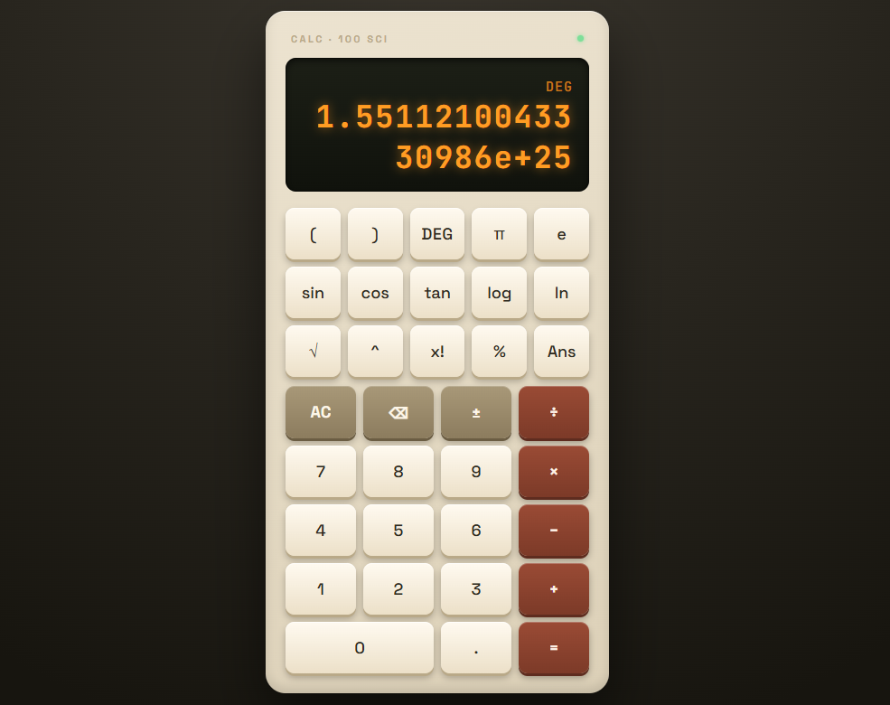

# Scientific Calculator 🧮

A vintage-instrument-styled scientific calculator built with vanilla JavaScript — featuring a hand-written expression tokenizer and recursive descent parser (no `eval()`), trigonometric/logarithmic functions, DEG/RAD switching, and a skeuomorphic 1970s desk-calculator UI.

Part of the [Frontend Fundamentals](../) learning series.

## ✨ Features

- Full expression input: `sin(30)+2^3×(4-1)!` evaluated with correct operator precedence
- Scientific functions: `sin`, `cos`, `tan`, `log` (base 10), `ln` (natural log), `√` (square root)
- Constants: `π`, `e`
- Power (`^`), modulo (`%`), factorial (`x!`)
- DEG / RAD mode toggle for trigonometric functions
- `Ans` — recall the last computed result
- Sign toggle (`±`) and backspace (`⌫`)
- Implicit multiplication: `2(3+4)` is automatically read as `2×(3+4)`
- Auto-balances unclosed parentheses on evaluation
- Keyboard support for digits and basic operators
- Skeuomorphic UI: brushed-ivory case, amber LED-style display with glow, 3D press-down keys

## 🎯 What I Practiced

- **Tokenizing** — converting a raw input string into a stream of typed tokens (numbers, identifiers, symbols)
- **Recursive descent parsing** — a layered grammar (`expression → term → power → postfix → primary`) that encodes operator precedence structurally, the same technique used in real compilers and language interpreters
- **Right-associative operators** — implementing `^` (power) so `2^3^2` evaluates right-to-left, unlike `+`/`-`/`*`/`/`
- **Recursive evaluation** — computing a result by walking the parsed structure instead of using `eval()`
- **Degree ↔ radian conversion** for trig functions, since `Math.sin()` always expects radians
- **Regex-based string manipulation** — detecting the trailing number segment for `±` and decimal-point validation
- **Event delegation** across two separate button grids using a single listener with `data-action`
- **Skeuomorphic CSS** — layered `box-shadow` (outer drop shadow + inset highlight) to simulate physical button depth, plus `text-shadow` for an LED glow effect
- **`prefers-reduced-motion`** — respecting accessibility preferences for the power-indicator animation

## 🛠️ Built With

- HTML5
- CSS3 (Grid, Custom Properties, skeuomorphic shadows)
- Vanilla JavaScript (custom tokenizer + parser, no external math libraries)
- Google Fonts (JetBrains Mono, Space Grotesk)

## 📸 Preview



## 📂 Project Structure

```
Calculator-App/
├── index.html
├── style.css
├── script.js
└── README.md
```

## 🚀 Running Locally

No build tools required — it's a static site (needs internet for the Google Fonts CDN).

```bash
git clone https://github.com/shimul1725/frontend-fundamentals.git
cd frontend-fundamentals/Calculator-App
```

Open `index.html` in your browser, or use the **Live Server** extension in VS Code.

## 📝 Notes

This project started as a basic two-operand calculator (Event Handling, Logic Building) and was extended into a full scientific calculator with expression parsing — a step up in complexity that introduces real parsing/compiler concepts. Known limitation: input validation is intentionally simple (built for a learning project, not a bulletproof parser), so malformed expressions fall back to displaying `Error` rather than pinpointing the exact issue.

## 👤 Author

**Md Moniruzzaman**
- GitHub: [@shimul1725](https://github.com/shimul1725)
- Email: shimul.tu.dortmund@gmail.com