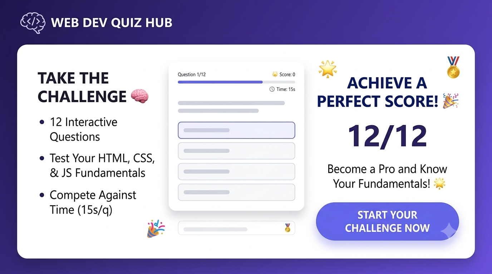

# Quiz App (with Timer) 🧠

A timed multiple-choice quiz app testing HTML/CSS/JS fundamentals, built with vanilla JavaScript. Features a countdown timer per question, instant right/wrong feedback, and a three-screen flow (start → quiz → result).

Part of the [Frontend Fundamentals](../) learning series.

## ✨ Features

- 12 multiple-choice questions covering HTML, CSS, and JavaScript basics
- 15-second countdown timer per question with a shrinking progress bar
- Progress bar turns red in the last 5 seconds as a visual warning
- Auto-advances to the next question if time runs out (marks it as unanswered)
- Instant visual feedback — correct answer highlights green, wrong pick highlights red
- Live score tracking across the quiz
- Result screen with a personalized message based on final score
- "Try Again" fully resets state for a clean restart

## 🎯 What I Practiced

- **`setInterval()`** — running the countdown timer, decrementing every second
- **`clearInterval()`** — stopping the timer when an answer is submitted or time runs out, avoiding the common bug of multiple timers stacking up across questions
- **`setTimeout()`** — a one-time delay after answering, giving the user a moment to see the color feedback before auto-advancing
- **Closures** — each option button's click handler "remembers" its own `index` value from the `forEach` loop, even though the handler runs much later when the user clicks
- **Multi-screen state management** — toggling a `.hidden` class to switch between start/quiz/result screens within a single page (a small-scale precursor to client-side routing)
- **State tracking across async time-based events** — keeping `currentIndex`, `score`, `timeLeft`, and `hasAnswered` in sync as the timer and click handlers both mutate state
- **Edge case handling** — using `selectedIndex = -1` to represent "no answer selected" when time runs out, without breaking the correct/wrong highlight logic

## 🛠️ Built With

- HTML5
- CSS3 (Flexbox, transitions)
- Vanilla JavaScript (ES6+)

## 📸 Preview



## 📂 Project Structure

```
Quiz-App/
├── index.html
├── style.css
├── script.js
└── README.md
```

## 🚀 Running Locally

No build tools required — it's a static site.

```bash
git clone https://github.com/shimul1725/frontend-fundamentals.git
cd frontend-fundamentals/Quiz-App
```

Open `index.html` in your browser, or use the **Live Server** extension in VS Code.

## 📝 Notes

This project completes **Stage 2 (JavaScript Fundamentals + DOM)** of the Frontend Fundamentals series — DOM manipulation, event handling/delegation, array methods, `localStorage`, and now timers + closures. Questions live in a simple array of objects at the top of `script.js`, making it easy to add more or swap in a different topic entirely.

## 👤 Author

**Md Moniruzzaman**
- GitHub: [@shimul1725](https://github.com/shimul1725)
- Email: shimul.tu.dortmund@gmail.com