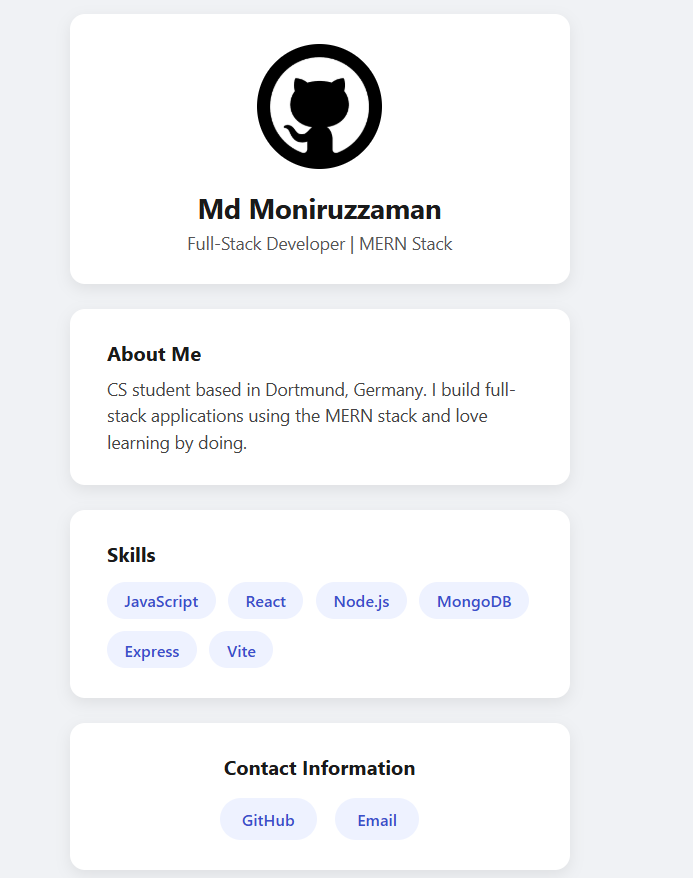
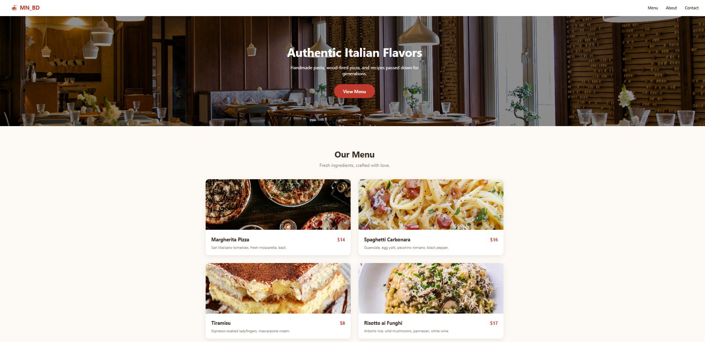

# Frontend Fundamentals 🎨

A collection of small practice projects built while strengthening core **HTML, CSS, and JavaScript** fundamentals — one focused concept at a time, before moving deeper into React and full-stack development.

Each folder is a self-contained mini-project with its own `README.md`.

## 📁 Projects

<table>
  <tr>
    <th width="160">Preview</th>
    <th>Project</th>
    <th>Concepts Covered</th>
    <th>Status</th>
  </tr>
  <tr>
    <td></td>
    <td><a href="./personal-bio-card">01 · Personal Bio Card</a></td>
    <td>Semantic HTML, Flexbox, CSS Variables</td>
    <td>✅ Done</td>
  </tr>
  <tr>
    <td></td>
    <td><a href="./Responsive-Pricing-Cards">02 · Responsive Pricing Cards</a></td>
    <td>CSS Grid, Media Queries, Hover Effects</td>
    <td>✅ Done</td>
  </tr>
  <tr>
    <td></td>
    <td><a href="./Restaurant-Menu">03 · Restaurant Menu Landing Page (MN_BD)</a></td>
    <td>Flexbox + Grid combined, Animations</td>
    <td>✅ Done</td>
  </tr>
  <tr>
    <td></td>
    <td><a href="./To-Do-List-App">04 · To-Do List App</a></td>
    <td>DOM Manipulation, Event Delegation, Array Methods, localStorage</td>
    <td>✅ Done</td>
  </tr>
  <tr>
    <td></td>
    <td><a href="./Calculator-App">05 · Calculator App (Scientific)</a></td>
    <td>Event Handling, Tokenizing & Recursive Descent Parsing, Logic Building</td>
    <td>✅ Done</td>
  </tr>
  <tr>
    <td></td>
    <td><a href="./Quiz-App-with-Timer">06 · Quiz App (with Timer)</a></td>
    <td>setInterval/setTimeout, Closures, State Tracking</td>
    <td>✅ Done</td>
  </tr>
</table>

## 🎯 Why This Repo Exists

Before diving deeper into React, Node.js, and full-stack projects (see my other repos: [my-profile-portfolio](https://github.com/shimul1725/my-profile-portfolio), [social-media](https://github.com/shimul1725/social-media)), this repo is where I revisit and solidify the fundamentals — semantic markup, layout systems, and vanilla JavaScript — with small, focused builds instead of large ones.

## 🛠️ Tech Used

- HTML5
- CSS3 (Flexbox, Grid, Custom Properties)
- Vanilla JavaScript

## 🚀 Running Any Project

Each project is a static site — no build step needed.

```bash
git clone https://github.com/shimul1725/frontend-fundamentals.git
cd frontend-fundamentals/<project-folder>
```

Open `index.html` in your browser, or use the **Live Server** extension in VS Code.

## 👤 Author

**Md Moniruzzaman**
- GitHub: [@shimul1725](https://github.com/shimul1725)
- Email: shimul.tu.dortmund@gmail.com