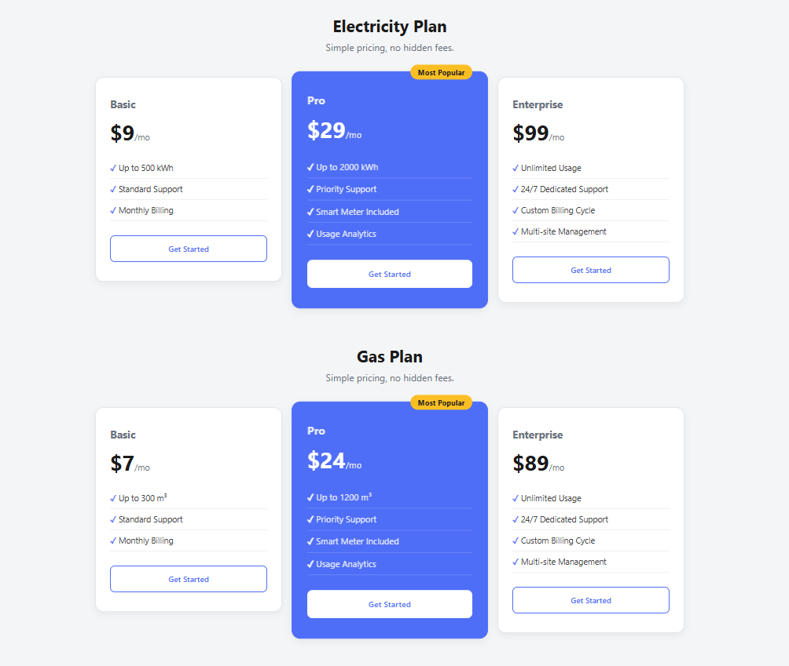

# Responsive Pricing Cards 💳

Responsive pricing sections built with pure CSS Grid — no frameworks. Two plan types (Electricity & Gas), each with a highlighted "Most Popular" tier, adapting from a 3-column to 1-column layout as the screen shrinks.

Part of the [Frontend Fundamentals](../) learning series.

## ✨ Features

- Two pricing sections (Electricity Plan, Gas Plan) sharing the same reusable card structure
- A "Most Popular" featured card with a badge and distinct highlight color
- Smooth hover lift effect on every card
- Fully responsive: 3 columns → 2 columns (tablet) → 1 column (mobile)

## 🎯 What I Practiced

- **CSS Grid** — `grid-template-columns: repeat(3, 1fr)` for equal-width card layout
- **Media Queries** — breakpoints at `768px` and `480px` to reflow the grid for tablet and mobile
- **`grid-column: span`** — making the featured card span the full row width at the tablet breakpoint
- **Hover effects & transitions** — `transform: translateY()` and `box-shadow` combined for a "lift" effect
- **`::before` pseudo-element** — adding checkmarks to feature list items without extra HTML
- **`:last-child`** — removing extra spacing after the final section without adding a class

## 🛠️ Built With

- HTML5
- CSS3 (Grid, Media Queries, Custom Properties, Pseudo-elements)

## 📸 Preview



## 📂 Project Structure

```
pricing-cards/
├── index.html
├── style.css
└── README.md
```

## 🚀 Running Locally

No build tools required — it's a static site.

```bash
git clone https://github.com/shimul1725/frontend-fundamentals.git
cd frontend-fundamentals/pricing-cards
```

Open `index.html` in your browser, or use the **Live Server** extension in VS Code.

## 📝 Notes

This project focused on CSS Grid and responsive breakpoints, building on the Flexbox fundamentals from `personal-bio-card`. Next up: a Restaurant Menu Landing Page combining Flexbox and Grid together.

## 👤 Author

**Md Moniruzzaman**
- GitHub: [@shimul1725](https://github.com/shimul1725)
- Email: shimul.tu.dortmund@gmail.com