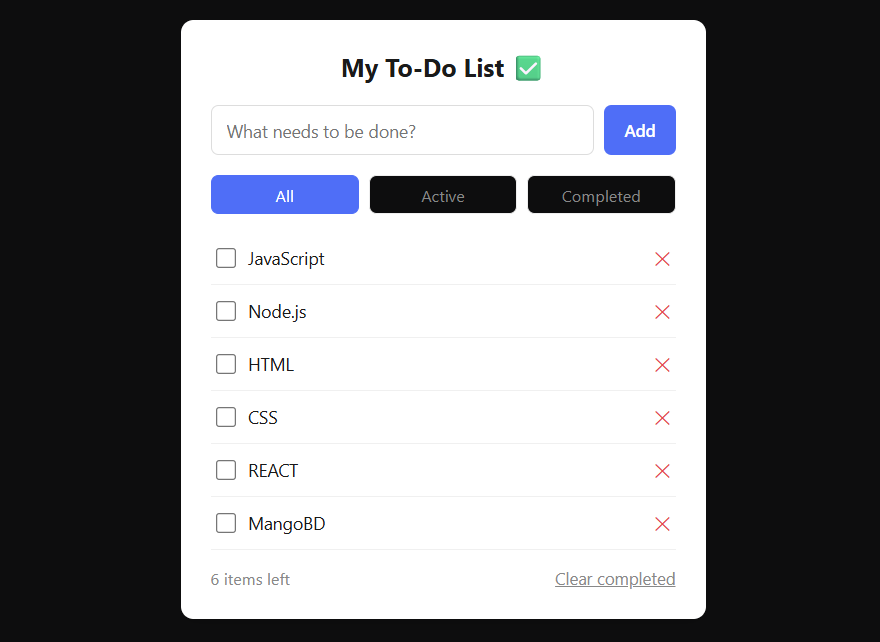

# To-Do List App ✅

A vanilla JavaScript to-do list app with filtering, persistent storage, and no frameworks. Built to practice core DOM manipulation and state-driven rendering — the same pattern React uses under the hood, just without React.

Part of the [Frontend Fundamentals](../) learning series.

## ✨ Features

- Add, complete, and delete tasks
- Filter tasks by **All / Active / Completed**
- "X items left" counter
- Clear all completed tasks at once
- Tasks persist after page reload (`localStorage`)
- Add tasks with **Enter** key, not just button click

## 🎯 What I Practiced

- **State + Render pattern** — a single `tasks` array as the source of truth; the UI is rebuilt from state on every change instead of being manually patched
- **Event Delegation** — one click listener on the parent `<ul>` instead of one per `<li>`, using `e.target.closest()` to identify what was clicked
- **Array methods** — `.filter()` (delete, filtering by status), `.map()` (toggle complete), `.reduce()` (counting active items)
- **`localStorage`** — persisting state as JSON across page reloads
- **Spread operator** for immutable object updates (`{ ...task, completed: !task.completed }`)
- **Data attributes** (`data-id`, `data-filter`) to link DOM elements back to state

## 🛠️ Built With

- HTML5
- CSS3 (Custom Properties)
- Vanilla JavaScript (ES6+)

## 📸 Preview



## 📂 Project Structure

```
todo-app/
├── index.html
├── style.css
├── script.js
└── README.md
```

## 🚀 Running Locally

No build tools required — it's a static site.

```bash
git clone https://github.com/shimul1725/frontend-fundamentals.git
cd frontend-fundamentals/todo-app
```

Open `index.html` in your browser, or use the **Live Server** extension in VS Code.

## 📝 Notes

This project builds directly on the semantic HTML / CSS foundation from `personal-bio-card`, adding the JavaScript layer: DOM manipulation, event handling, and browser storage. Next up: a Calculator App to practice event handling and logic building further.

## 👤 Author

**Md Moniruzzaman**
- GitHub: [@shimul1725](https://github.com/shimul1725)
- Email: shimul.tu.dortmund@gmail.com